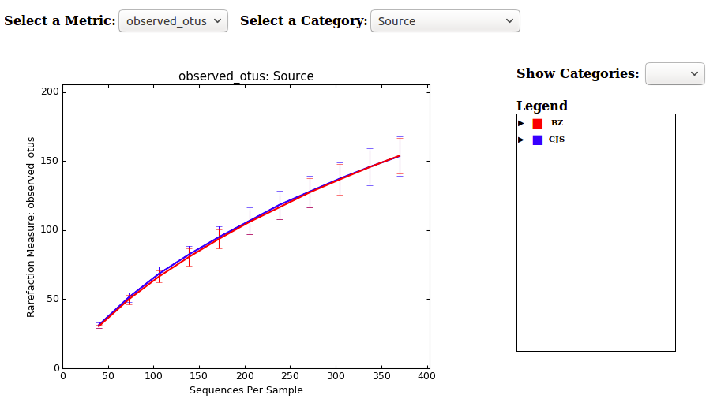
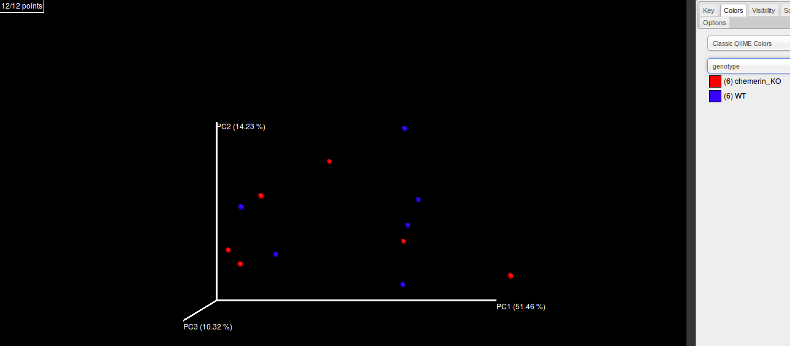
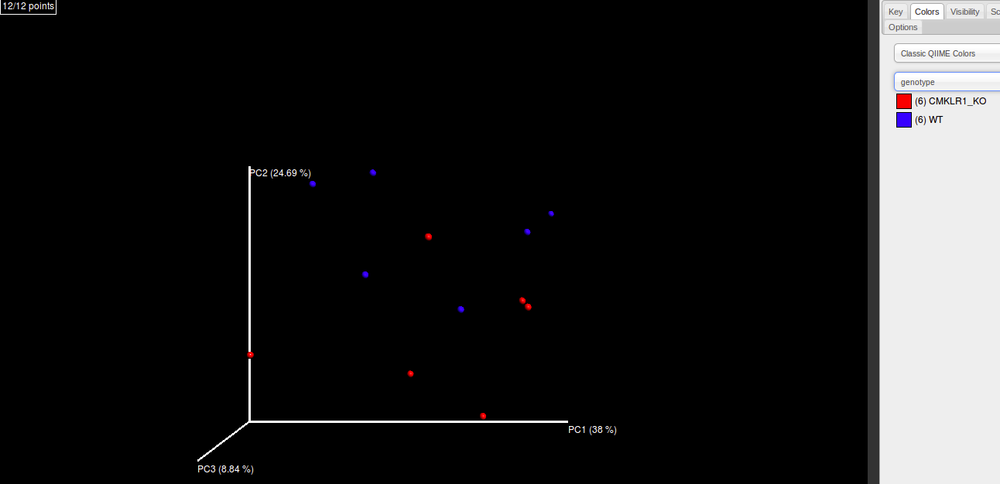
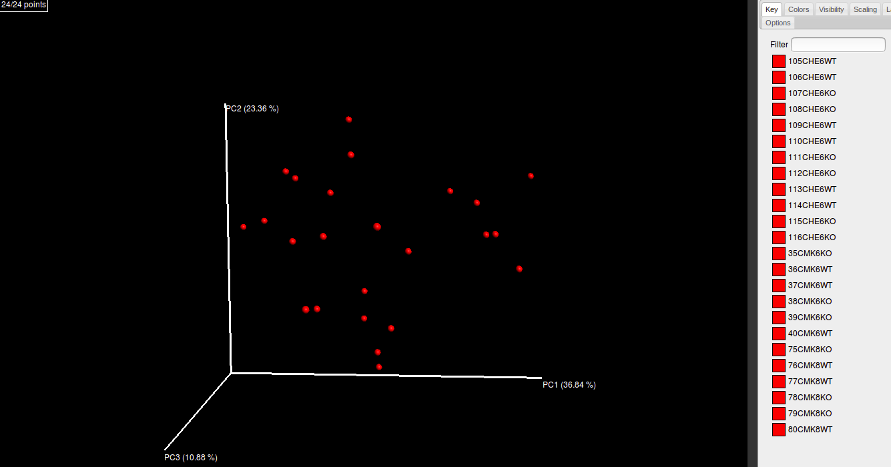

#An introduction to taxonomic analysis of amplicon and shotgun data using QIIME

##Key Learning Outcomes
---------------------

After completing this practical the trainee should be able to:

-   Understand the open source software package QIIME for analysis

-   Perform a taxonomic analysis on a 16S rRNA amplicon dataset

-   Conduct 16S taxonomic analysis on shotgun data

##Resources you will be using
-------------------------

### Tools Used: Part 1. 16S Analysis 


QIIME :  http://qiime.org/

PEAR: http://sco.h-its.org/exelixis/web/software/pear/doc.html

FASTX toolkit (v0.0.14): http://hannonlab.cshl.edu/fastx_toolkit/download.html

BBMap: http://sourceforge.net/projects/bbmap

VSEARCH: https://github.com/torognes/vsearch

SortMeRNA: http://bioinfo.lifl.fr/RNA/sortmerna/

STAMP: http://kiwi.cs.dal.ca/Software/STAMP

### Tools Used: Part 2. 16S analysis of whole genome shotgun sequencing

rRNASelector :   http://www.ezbiocloud.net/sw/rrnaselector

MEGAN6 : http://ab.inf.uni-tuebingen.de/software/megan6


###Useful Links
------------

FASTQ Encoding:   

http://en.wikipedia.org/wiki/FASTQ_format#Encoding

QIIME Tutorials:
http://qiime.org/tutorials/tutorial.html

16S Tutorials:
https://github.com/mlangill/microbiome_helper/wiki/16S-tutorial-(chemerin)

Lee et al. (2011). rRNASelector: a computer program for selecting ribosomal RNA encoding sequences from metagenomic and metatranscriptomic shotgun libraries. J. Microbiol. 49(4):689-691.

### Sources of Data
---

### Part 1: 16S Analysis

- Data : Mouse gut microbial composition affected by the protein chemerin.  https://www.dropbox.com/s/4fqgi6t3so69224/Sinal_Langille_raw_data.tar.gz
https://www.dropbox.com/s/r2jqqc7brxg4jhx/16S_chemerin_tutorial.zip

- RDP_trainset16_022016.fa (20 MB) is a subset of the Ribosome Database Project (RDP) filtered to include only bacteria.
https://www.dropbox.com/s/qnlsv7ve2lg6qfp/RDP_trainset16_022016.fa?dl=1 

### Part 2: 16S analysis of whole genome shotgun sequencing

-   Li et al. (2013). Draft Genome Sequence of Thermoanaerobacter sp. Strain A7A, Reconstructed from a Metagenome Obtained from a High-Temperature Hydrocarbon Reservoir in the Bass Strait, Australia. Genome Announc. 1(5): e00701-13.

### Overview
------------

In this tutorial we will look at the open source software package QIIME (pronounced ’chime’). QIIME stands for Quantitative Insights Into Microbial Ecology. The package contains many tools that enable users to analyse and compare microbial communities. 

After completion of this tutorial, you should be able to perform a taxonomic analysis on a Illumina pair end 16S rRNA amplicon dataset. In addition you should be able to do 16S rRNA taxonomic analysis on shotgun data using the tool rRNASelector in combination with QIIME and other third party tools.

### _Part 1: 16S Analysis_

###De novo OTU picking and diversity analysis using Illumina data
---


### Introduction

The workflow for 16S analysis in general is as follows:

1. Split multiplexed reads to samples
2. Join overlapping read pairs
4. Filter reads on quality and length
5. Filter Chimera sequences
6. Assign reads to samples
7. Pick operational taxonomic units (OTUs) for each sample
8. Alpha diversity analysis and rarefaction
9. Beta diversity analysis and Taxonomic composition
10. PCA analysis
 


16S analysis is a method of microbiome analysis (compared to shotgun metagenomics) that targets the 16S ribosomal RNA gene, as this gene is present in all prokaryotes. It features regions that are conserved among these organisms, as well as variable regions that allow distinction among organisms. These characteristics make this gene useful for analyzing microbial communities at reduced cost compared to metagenomic techniques. A similar workflow can be applied to eukaryotic micro-organisms using the 18S rRNA gene.


The tutorial dataset was originally used in a project to determine whether knocking out the protein chemerin affects gut microbial composition. Originally 116 mouse samples acquired from two different facilities were used for this project (only 24 samples were used in this tutorial dataset, for simplicity). 

### The Mapping file 

Metadata associated with each sample is indicated in the mapping file (map.txt). The mapping file associates the read data files for a sample to it's metadata. The mapping file can contain information on your experimental design. The format is very strict; columns are separated with a single TAB character; the header names have to be typed exactly as specified in the documentation. A good sample description is useful as it is used in the legends of the figures QIIME generates.

In the mapping (map.txt) file the genotypes of interest can be seen: wildtype (WT), chemerin knockout (chemerin_KO), chemerin receptor knockout (CMKLR1_KO) and a heterozygote for the receptor knockout (HET). Also of importance are the two source facilities: "BZ" and "CJS". It is important to include as much metadata as possible, so that it can be easily explored later on.


Open Terminal and go to the dataset's directory:

```bash
cd ~/Desktop/16S_chemerin_tutorial
ls -lhtr

```

"fastq" is the directory containing all the sequencing files, which we are going to process. The file "map.txt" contains metadata about the samples. We can look at it with the less command (hit "q" to exit):

```bash
less -S map.txt
```

The first column is the sample IDs, the next 2 are blank (note the file is tab-delimited, meaning each column is separated by a tab, not just whitespace) and the 4th column contains FASTA filenames (these filenames are based on what we will produce in this pipeline). The rest of the columns are metadata about the samples.

Here is what the first 4 lines should look like:

```
SampleID       BarcodeSequence LinkerPrimerSequence    FileInput       Source  Mouse#  Cage#   genotype        SamplingWeek
105CHE6WT                       105CHE6WT_S325_L001.assembled_filtered.nonchimera.fasta BZ      BZ25    7       WT      wk6
106CHE6WT                       106CHE6WT_S336_L001.assembled_filtered.nonchimera.fasta BZ      BZ26    7       WT      wk6
107CHE6KO                       107CHE6KO_S347_L001.assembled_filtered.nonchimera.fasta BZ      BZ27    7       chemerin_KO     wk6
```

!!! note "Note"
The Barcode and LinkerPrimerSequence are absent for this tutorial, these would be used for assigning multiplexed reads to samples and for quality control. Our tutorial data set is already de-multiplexed. What QIIME could be used? 
  
Execute the following command and test the mapping file for potential errors:

    validate_mapping_file.py -m map.txt -o map_output

There shouldn’t be any errors, but if errors occur a corrected mapping file will be written to the directory map_output


### Join directory of PE reads


First we need to join the overlapping Illumina Pair End (PE) reads contained in the fastq directory for each sample.


    cd ~/Desktop/16S_chemerin_tutorial  
    run_pear.pl -p 4 -o stitched_reads fastq/*fastq


```
"-p 4" indicates this job should be run on 4 CPU 
"-o stitched_reads" indicates that the output folder)
```

Four FASTQ files will be generated for each set of paired-end reads:
    (1) assembled reads (used for downstream analyses)
    (2) discarded reads (often abnormal reads, e.g. large run of Ns).
    (3) unassembled forward reads
    (4) unassembled reverse reads

The default log file "pear_summary_log.txt" contains the percent of reads either assembled, discarded or unassembled.

!!! note "Question 1" 
    What percent of reads were successfully stitched for sample 40CMK6WT?

###Filtering reads by quality and length

We will now filter our reads on a quality score cut-off of 30 over 90% of bases and at a maximum length of 400 bp, which are considered reasonable filtering criteria (~2 min on 1 CPU):

```bash
cd ~/Desktop/16S_chemerin_tutorial
read_filter.pl -q 30 -p 90 -l 400 -thread 4 -c both stitched_reads/*.assembled*fastq
```

The **"-c both"** option above checks for the default forward and reverse degenerate primer sequences to match exactly in each sequences (You can use whatever primer sequences you want. However, the primer sequences in this case are set by default in the script, which you can look at with **"read_filter.pl -h"**). If you don't set the **"-c"** option to either **"both"** or **"forward"** then there wont be any primer matching.

By default this script will output filtered FASTQs in a folder called **"filtered_reads"** and the percent of reads thrown out after each filtering step is recorded in **"read_filter_log.txt"**. This script is just a convenient way to run two popular tools for read filtering: **FASTX-toolkit and BBMAP**.

If you look in this logfile you will note that ~40% of reads were filtered out for each sample. You can also see the counts and percent of reads dropped at each step.

!!! note "Question 2"
    How many reads of sample 36CMK6WT were filtered out for not containing a match to the forward primer (which is the default setting in this case).

###Conversion to FASTA and removal of chimeric reads

The next steps in the pipeline require the simple conversion of sequences from FASTQ to FASTA format, using the following command (< 1 min on 1 CPU):

```bash
cd ~/Desktop/16S_chemerin_tutorial
run_fastq_to_fasta.pl -p 4 -o fasta_files filtered_reads/*fastq
```

Note that this command removes any sequences containing "N" (a fully ambiguous base read), which is << 1% of the reads after the read filtering steps above.

During PCA amplification 16S rRNA sequences from different organisms can sometimes combine to form hybrid molecules called chimeric sequences. It's important to remove these so they aren't incorrectly called as novel Operational Taxonomic Units (OTUs). Unfortunately, not all chimeric reads will be removed during this step, which is something to keep in mind during the next steps.

You can run chimera checking with VSEARCH with this command (~3 min on 1 CPU):

```bash
chimera_filter.pl -type 1 -thread 4 -db /home/shared/rRNA_db/Bacteria_RDP_trainset15_092015.fa fasta_files/*fasta
```

This script will remove any reads called either ambiguously or as chimeric, and output the remaining reads in the "non_chimeras" folder by default.

By default the logfile "chimeraFilter_log.txt" is generated containing the counts and percentages of reads filtered out for each sample.

!!! note "Question 3"
    What is the mean percent of reads retained after this step, based on the output in the log file ("nonChimeraCallsPercent" column)?

!!! note "Question 4"
     What percent of stitched reads was retained for sample 75CMK8KO after all the filtering steps 

!!! hint 
    "you will need to compare the original number of reads to the number of reads output by chimera_filter.pl)?"

### Assign samples to the reads

Now that we have adequately prepared the reads, we can now run OTU picking using QIIME. An Operational Taxonomic Unit (**OTU**) defines a taxonomic group based on sequence similarity among sampled organisms. QIIME software clusters sequence reads from microbial communities in order to classify its constituent micro-organisms into OTUs. QIIME requires FASTA files to be input in a specific format (specifically, sample names need to be at the beginning of each header line). We have provided the mapping file (**"map.txt"**), which links filenames to sample names and metadata.

As we saw the map.txt (e.g. with **less -S**) had 2 columns without any data: "**BarcodeSequence**" and "**LinkerPrimerSequence**". We don't need to use these columns today. These would normally be populated for multiplexed data.

Also, you will see that the "**FileInput**" column contains the names of each FASTA file, which is what we need to specify for the command below.

This command will correctly format the input FASTA files and output a single FASTA:

```bash
add_qiime_labels.py -i non_chimeras/ -m map.txt -c FileInput -o combined_fasta 
```

If you take a look at **combined_fasta/combined_seqs.fna** you can see that the first column of header line is a sample name taken from the mapping file.

###De novo OTU picking

Now that the input file has been correctly formatted we can run the actual OTU picking program.

Several parameters for this program can be specified into a text file, which will be read in by "pick_open_reference_otus.py":

```bash
echo "pick_otus:threads 1" >> clustering_params.txt
echo "pick_otus:sortmerna_coverage 0.8" >> clustering_params.txt
echo "pick_otus:sortmerna_db /home/shared/pick_otu_indexdb_rna/97_otus" >> clustering_params.txt
```

We will be using the **uclust method** of **open-reference OTU picking**. In open-reference OTU picking, reads are first clustered against a reference database; then, a certain percent (10% in the below command) of those reads that failed to be classified are sub-sampled to create a new reference database and the remaining unclassified reads are clustered against this new database. This **de novo** clustering step is repeated again by default using the below command (can be turned off to save time with the **"–suppress_step4"** option).

We are actually also retaining singletons (i.e. OTUs identified by 1 read), which we will then remove in the next step. Note that "**$PWD**" is just a variable that contains the path to your current directory. This command takes ~7 min with 1 CPU. Lowering the "**-s**" parameter's value will greatly affect running speed.

```bash
pick_open_reference_otus.py -i $PWD/combined_fasta/combined_seqs.fna -o $PWD/clustering/ -p $PWD/clustering_params.txt -m sortmerna_sumaclust -s 0.1 -v --min_otu_size 1
```  
###Remove low confidence OTUs
We will now remove low confidence OTUs, i.e. those that are called by a low number of reads. It's difficult to choose a hard cut-off for how many reads are needed for an OTU to be confidently called, since of course OTUs are often at low frequency within a community. A reasonable approach is to remove any OTU identified by fewer than 0.1% of the reads, given that 0.1% is the estimated amount of sample bleed-through between runs on the Illumina Miseq:

```
remove_low_confidence_otus.py -i $PWD/clustering/otu_table_mc1_w_tax_no_pynast_failures.biom -o $PWD/clustering/otu_table_high_conf.biom
```

Since we are just doing a test run with few sequences, the threshold is 1 OTU regardless. However, this is an important step with real datasets. Note: Sequence errors can give rise to spurious OTUs, we can filter out OTUs that only contain a single sequence (singletons). QIIME allows you to do this quite easily, or you could also remove abundant taxa if you are more interested in rare taxa.


We can compare the summaries of these two BIOM files:

```
biom summarize-table -i clustering/otu_table_mc1_w_tax_no_pynast_failures.biom -o clustering/otu_table_mc1_w_tax_no_pynast_failures_summary.txt

biom summarize-table -i clustering/otu_table_high_conf.biom -o clustering/otu_table_high_conf_summary.txt
```

The first four lines of clustering/otu_table_mc1_w_tax_no_pynast_failures_summary.txt are:

```
Num samples: 24
Num observations: 2420
Total count: 12014
Table density (fraction of non-zero values): 0.097
This means that for the 24 separate samples, 2420 OTUs were called based on 12014 reads. Only 9.7% of the values in the sample x OTU table are non-zero, meaning that most OTUs are in a small number of samples.
```

In contrast, the first four lines of clustering/otu_table_high_conf_summary.txt are:

```
Num samples: 24
Num observations: 884
Total count: 10478
Table density (fraction of non-zero values): 0.193
```

After removing low-confidence OTUs, only **36.5%** were retained: **the number of OTUs dropped from 2420 to 884**. This effect is generally even more drastic for bigger datasets. However, the numbers of reads only dropped from 12014 to 10478 (so **87% of the reads were retained**). You can also see that the table density increased, as we would expect.

The pipeline creates a Newick-formatted phylogenetic
tree **(*.tre)** in the clustering directory.
You can run the program ’figtree’ from the terminal, a graphic interface will be launched by typing ’figtree’ then hit the return key. 

```bash
figtree
```
View the tree by opening the file ’*.tre’ in the ’clustering’ folder **(Desktop->Taxonomy->otus)**. The tree that is produced is too complex to be of much use. We will look at a different tool, Megan 6, which produces a far more useful tree. 

Megan can be opened from the terminal by typing **MEGAN**. If you are asked for a licence select the following file /mnt/workshop/data/HT\_MEGAN5\_registration\_for\_academic_use.txt. From the File menu select Import -> BIOM format.
Find your biom file and import it.

Megan will generate a tree that is far more informative than the one produced with FigTree. You can change the way Megan displays the data by clicking on the various icons and menu items. Please spend some time exploring your data.

The Word Cloud visualization is interesting, too, if you want to find out which samples are similar and which samples stand out.


###View OTU statistics

You can generate some statistics, e.g. the number of reads assigned, distribution among samples. Some of the statistics are useful for further downstream analysis, e.g. beta-diversity analysis.  **Write down the minimum value under Counts/sample summary**. We need it for beta-diversity analysis.
You can look at the read depth per sample in **clustering/otu_table_high_conf_summary.txt**, here are the first five samples (they are sorted from smallest to largest):

```
Counts/sample detail:
106CHE6WT: 375.0
111CHE6KO: 398.0
39CMK6KO: 410.0
113CHE6WT: 412.0
108CHE6KO: 413.0
```

!!! note "Question 5"
    What is the read depth for sample "75CMK8KO"?

We need to subsample the number of reads for each sample to the same depth, which is necessary for several downstream analyses. This is called **rarefaction**, a technique that provides an indication of **species richness** for a given number of samples. First it indicates if you have sequence enough to identify all species. Second we want to rarify the read depth of samples to a similar number of reads for comparative analysis. There is actually quite a lot of debate about whether rarefaction is necessary (since it throws out data), but it is still the standard method used in microbiome studies. We want to rarify the read depth to the sample with the lowest "reasonable" number of reads. Of course, a "reasonable" read depth is quite subjective and depends on how much variation there is between samples.

###Rarify reads

```{bash}
mkdir final_otu_tables
single_rarefaction.py -i clustering/otu_table_high_conf.biom -o final_otu_tables/otu_table.biom -d 355
```
###Visualize taxonomic composition
---

We will now group sequences by taxonomic assignment at various levels. The following command produces a number of charts that can be viewed in a browser. The command takes about 5 minutes to complete

```
summarize_taxa_through_plots.py -i final_otu_tables/otu_table.biom -o  wf_taxa_summary -m map.txt 
```

To view the output, open a web browser from the Applications ->Internet menu. You can use Google chrome, Firefox or Chromium. In  Firefox use the File menu to select 

```
Desktop ->;Taxonomy ->; wf_taxa_summary ->; taxa_summary_plots 
and open either area_charts.html or bar_chars.html. 
```

I prefer the bar charts myself. The top chart visualizes taxonomic composition at phylum level for each of the samples. The next chart goes down to class level and following charts go another level up again. The charts (particularly the ones more at the top) are very useful for discovering how the communities in your samples differ from each other. 


###Alpha diversity within samples and rarefaction curves
---

Alpha diversity is the microbial diversity within a sample. QIIME can calculate a lot of metrics, but for our tutorial, we generate 3 metrics from the alpha rarefaction workflow: chao1 (estimates species richness); observed species metric (the count of unique OTUs); phylogenetic distance. The following workflow generates rarefaction plots to visualize alpha diversity.

Run the following command from within your taxonomy directory, this should take a few minutes:

```bash
alpha_rarefaction.py -i final_otu_tables/otu_table.biom -o plots/alpha_rarefaction_plot -t clustering/rep_set.tre --min_rare_depth 40 --max_rare_depth 355 -m map.txt  --num_steps 10
```

First we are going to view the rarefaction curves in a web browser by opening the resulting HTML file to view the plots: 

    plots/alpha_rarefaction_plot/alpha_rarefaction_plots/rarefaction_plots.html

Choose "observed_otus" as the metric and "Source" as the category. You should see this plot:



There is no difference in the number of OTUs identified in the guts of mice from the BZ facility than the CJS facility, based on this dataset. However, since the rarefaction curves have not reached a plateau, it is likely that this comparison is just incorrect to make with so few reads. Indeed, with the full dataset you do see a difference in the number of OTUs.

In general the more reads you have, the more OTUs you will observe. If a rarefaction curve start to flatten, it means that you have probably sequenced at sufficient depth, in other words, producing more reads will not significantly add more OTUs. If on the other hand hasn’t flattened, you have not sampled enough to capture enough of the microbial diversity and by extrapolating the curve you may be able to estimate how many more reads you will need. Consult the QIIME overview tutorial for further information.

Run the following command from within your taxonomy directory, this should take a few minutes to generate a heatmap of the level three taxonomy:

    make_otu_heatmap.py -i final_otu_tables/otu_table_L3.biom -o final_otu_tables/otu_table_L3_heatmap.pdf -c Treatment -m map.txt
    

### Beta diversity and beta diversity plots

Beta diversity analysis, is the assessment of differences between microbial communities/samples. As we have already observed, our samples contain different numbers of sequences. The first step is to remove sample heterogeneity by randomly selecting the same number of reads from every sample. This number corresponds to the ’minimum’ number recorded when you looked at the OTU statistics.  Now run the following command

```bash
beta_diversity_through_plots.py -i final_otu_tables/otu_table.biom -m map.txt -o bdiv_even -t otus/rep_set.tre -e 355
```

Good data quality and sample metadata is important for visualising metagenomics analysis. The output of these comparisons is a square matrix where a distance or dissimilarity is calculated between every pair of community samples, reflecting the dissimilarity between those samples. The data distance matrix can be then visualized with analyses such as PCoA and hierarchical clustering.

###Testing for statistical differences

So what's the next step? Since we know that source facility is such an important factor, we could analyze samples from each facility separately. This will lower our statistical power to detect a signal, but otherwise we cannot easily test for a difference between genotypes.

To compare the genotypes within the two source facilities separately we fortunately don't need to re-run the OTU-picking. Instead, we can just take different subsets of samples from the final OTU table. First though we need to make two new mapping files with the samples we want to subset:

```bash
head -n 1 map.txt >> map_BZ.txt; awk '{ if ( $3 == "BZ" ) { print $0 } }' map.txt >>map_BZ.txt
head -n 1 map.txt >> map_CJS.txt; awk '{ if ( $3 == "CJS" ) { print $0 } }' map.txt >>map_CJS.txt
```

These commands are split into 2 parts (separated by ";"). The first part writes the header line to each new mapping file. The second part is an awk command that prints any line where the 3rd column equals the id of the source facility. Note that awk splits by any whitespace by default, which is why the source facility IDs are in the 3rd column according to awk, even though we know this isn't true when the file is tab-delimited.

The BIOM "subset-table" command requires a text file with 1 sample name per line, which we can generate by these quick bash commands:

```bash
tail -n +2  map_BZ.txt | awk '{print $1}' > samples_BZ.txt
tail -n +2  map_CJS.txt | awk '{print $1}' > samples_CJS.txt
```

These commands mean that the first line (the header) should be ignored and then the first column should be printed to a new file. We can now take the two subsets of samples from the BIOM file:

```bash
biom subset-table -i final_otu_tables/otu_table.biom -a sample -s samples_BZ.txt -o final_otu_tables/otu_table_BZ.biom
biom subset-table -i final_otu_tables/otu_table.biom -a sample -s samples_CJS.txt -o final_otu_tables/otu_table_CJS.biom
```
We can now re-create the beta diversity plots for each subset:

```bash
beta_diversity_through_plots.py -m map_BZ.txt -t clustering/rep_set.tre -i final_otu_tables/otu_table_BZ.biom -o plots/bdiv_otu_BZ 
beta_diversity_through_plots.py -m map_CJS.txt -t clustering/rep_set.tre -i final_otu_tables/otu_table_CJS.biom -o plots/bdiv_otu_CJS
``` 
We can now take a look at whether the genotypes separate in the re-generated weighted beta diversity PCoAs for each source facility separately.

For the BZ source facility:



And for the CJS source facility:




Just by looking at these PCoA plots it's clear that if there is any difference it's subtle. To statistically evaluate whether the weighted UniFrac beta diversities differ among genotypes within each source facility, you can run an analysis of similarity (ANOSIM) test. These commands will run the ANOSIM test and change the output filename:

```
compare_categories.py --method anosim -i plots/bdiv_otu_BZ/weighted_unifrac_dm.txt -m map_BZ.txt -c genotype -o beta_div_tests
mv beta_div_tests/anosim_results.txt  beta_div_tests/anosim_results_BZ.txt 
```
```
compare_categories.py --method anosim -i plots/bdiv_otu_CJS/weighted_unifrac_dm.txt -m map_CJS.txt -c genotype -o beta_div_tests
mv beta_div_tests/anosim_results.txt  beta_div_tests/anosim_results_CJS.txt
```

You can take a look at the output files to see significance values and test statistics. The P-values for both tests are > 0.05, so there is no significant difference in the UniFrac beta diversities of different genotypes within each source facility.


###UniFrac beta diversity analysis

UniFrac is a particular beta-diversity measure that analyzes dissimilarity between samples, sites, or communities. We will now create UniFrac beta diversity (both **weighted** and **unweighted**) principal coordinates analysis (**PCoA**) plots. PCoA plots are related to principal components analysis (PCA) plots, but are based on any dissimilarity matrix rather than just a covariance/correlation matrix. 

**Note** the major difference between weighted and unweighted analysis is the inclusion of OTU abundance when calculating distances between communities. You should use weighted if the biological question you are trying to ask takes OTU abundance of your groups into consideration. If some samples are forming groups with weighted, then it's likely the larger or smaller abundances of several OTUs are the primary driving force in PCoA space, but when all OTUs are considered at equal abundance, these differences are lost (unweighted).

QIIME "**beta_diversity_through_plots.py**" takes the OTU table as input, as well as file which contains the phylogenetic relatedness between all clustered OTUs. One HTML file will be generated for the weighted and unweighted beta diversity distances:

```
plots/bdiv_otu/weighted_unifrac_emperor_pcoa_plot/index.html
plots/bdiv_otu/unweighted_unifrac_emperor_pcoa_plot/index.html
```

Open the weighted HTML file in your browser and take a look, you should see a PCoA very similar to this:




The actual metadata we are most interested in for this dataset is the "genotype" column of the mapping file, which contains the different genotypes I described at the beginning of this tutorial. Go to the "Colors" tab of the Emperor plot (which is what we were just looking at) and change the selection from "BarcodeSequence" (default) to "genotype". You should see a similar plot to this:


The WT genotype is spread out across both knockout genotypes, which is not what we would have predicted.

You'll see what's really driving the differences in beta diversity when you change the selection under the "Colors" tab from "genotype" to "Source":


###Using STAMP to test for particular differences

Often we're interested in figuring out which particular taxa (or other feature such as functions) differs in relative abundance between groups. There are many ways this can be done, but one common method is to use the easy-to-use program **STAMP**. We'll run STAMP on the full OTU table to figure out which genera differ between the two source facilities as an example.

Before running STAMP we need to convert our OTU table into a format that STAMP can read:

```
biom_to_stamp.py -m taxonomy final_otu_tables/otu_table.biom >final_otu_tables/otu_table.spf
```

If you take a look at "final_otu_tables/otu_table.spf" with less you'll see that it's just a simple tab-delimited table.

Now we're ready to open up STAMP, which you can either do by typing STAMP on the command-line or by clicking the side-bar icon.

Load "otu_table.spf" as the Profile file and "map.txt" as the Group metadata file.

As a reminder, the full paths of these files should be:
```
/home/mh_user/Desktop/16S_chemerin_tutorial/final_otu_tables/otu_table.spf and /home/mh_user/Desktop/16S_chemerin_tutorial/map.txt
```

Change the Group field to "Source" and the profile level to "Level_6" (which corresponds to the genus level). Change the heading from "Multiple groups" to "Two groups". The statistical test to "Welch's t-test" and the multiple test correction to "Benjamini-Hochberg FDR"

Change the plot type to "Bar plot". Look at the barplot for Prevotella and save it to a file.

!!! note "Question"
    Can you see how many genera are significant by clicking "Show only active features"?

### Part 2: 16S analysis of whole genome shotgun sequencing

###Closed reference OTU picking of 16S ribosomal rRNA fragments selected from a shotgun data set
---

In a closed-reference OTU picking process, reads are clustered against a reference sequence collection and any reads, which do not hit a sequence in the reference sequence collection, are excluded from downstream analyses. In QIIME, **pick\_closed\_reference\_otus.py** is the primary interface for closed-reference OTU picking in QIIME. If the user provides taxonomic assignments for sequences in the reference database,
those are assigned to OTUs. We could use this approach to perform
taxonomic analysis on shotgun data. We need to perform the following
steps:

1. Extract those reads from the data set that contain 16S ribosomal RNA
sequence. If there are less than (e.g.) 100 nucleotides of rRNA
sequence, the read should be discarded.
2. Remove non-rRNA sequence (flanking regions) from those reads
3. Run closed-reference OTU picking workflow
4. Visualise the results, e.g. in Megan

###Extraction of 16S rRNA sequence-containing reads with rRNASelector
---

We will analyze an Illumina paired-end dataset that has been drastically reduced in size for this tutorial, while preserving the majority of the 16S containing reads. The dataset is from the metagenome described at
<http://www.ncbi.nlm.nih.gov/pmc/articles/PMC3772140/>. There is a pdf in the working directory for this part of the tutorial. This is a paired end dataset, and where read pairs overlapped, they were merged into a single sequence. If read pairs did not overlap, both reads were included in the analysis. QC was performed using the EBI Metagenomics pipeline. We will use a tool called rRNASelector, which is freely available
(<http://www.ncbi.nlm.nih.gov/pubmed/21887657>) to select our 16S rRNA sequence containing reads. The tool invokes hmmsearch and uses trained hidden Markov models to detect reads with 16S rRNA sequence. The tool also trims the reads so that only 16S rRNA sequence is present in the fasta file we will feed into the QIIME workflow.

First, we need to go to our working directory. You will find a file called A7A-paired.fasta containing the sequence reads. Fire up **rRNASelector** from the command line.

    cd ~/Desktop/Taxonomy/A7A/
    rRNASelector

A graphical interface should appear. Note interaction with the interface may have a few seconds lag. 

1. Load the sequence file by clicking on ’File Choose’ at the top and navigate to the file A7A-paired.fasta. 
2. Select the file and click ’Open’. The tool will automatically fill in file names for the result files.
3. Change the Number of CPUs to ’4’ 
4. Select Prokaryote 16S (to include both bacterial and archaeal 16S sequences) 
5. Specify the location of the hmmsearch file by clicking the second ’File Choose’ button. Type in manually the location '**/usr/bin/hmmsearch**', 
6. Then click process. The run should take a few minutes to complete.

If all went well, you can close rRNASelector by clicking on Exit. You will have 3 new files in your directory, one containing untrimmed 16S reads, one containing trimmed 16S reads (**A7A-paired.prok.16s.trim.fasta**; that’s the one we want) and a file containing reads that do not contain (sufficient) 16S sequence.

###Closed-reference OTU picking workflow and visualization of results in Megan 6
---

We are now ready to pick our OTUs. We do that by running the following
command (all on one line and no space after gg\_otus-12-10):

```
pick_closed_reference_otus.py -i A7A-paired.prok.16s.trim.fasta -o ./cr_uc -r /mnt/workshop/tools/qiime_software/gg_otus-12_10-release/rep_set/97_otus.fasta -t /mnt/workshop/tools/qiime_software/gg_otus-12_10-release/taxonomy/97_otu_taxonomy.txt
```

We need to specify the following options. The command will take several minutes to run. When finished open Megan as described before, import the otu\_table.biom file and explore the results.

    -i input_file.fasta
    -o output_directory
    -r /path/to/reference_sequences
    -t /path/to/reference_taxonomy

###Bonus
-----


The QIIME overview tutorial at
(http://qiime.org/tutorials/tutorial.html) has a number of additional steps that you may find interesting; so feel free to try some of them out. Note hat we have not installed Cytoscape, so we cannot visualize OTU networks.

We will end this tutorial with a summary of what we have done and how well our analysis compares with the one in the paper.

Hopefully you will have acquired new skills that allow you to tackle your own taxonomic analyses. There are many more tutorials on the QIIME website that can help you pick the best strategy for your project (http://qiime.org/tutorials/) and https://github.com/mlangill/microbiome_helper/wiki/. There are alternatives that might suit your need better (e.g. VAMPS at http://vamps.mbl.ed>; mothur at http://www.mothur.org) and others.

